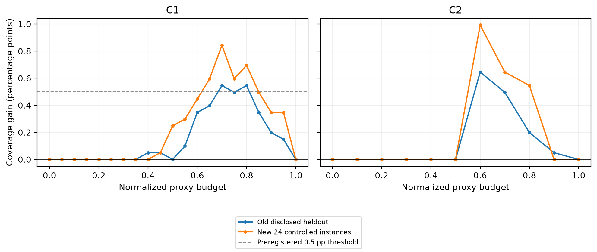

# A 的成本稳健性与新执行验证

结论：**PROMISING_LIMITED**。预定 Gate A 与 Gate B 均通过。固定头部后、再将所有通道等权后，动态补证的小幅优势仍保留；新24实例两成本均6/6族为正、全部删一族比较为正。值得将其保留为 SkillFlow 证据框架的有限应用信号，尚不足以主张强动态算法优势或投入大规模扩样。本批到此停止。

## 1. 旧增益来自哪里

| 旧 C0 留出配对 | 数量 | AUC 贡献 |
| --- | --- | --- |
| benefit | 47 | +0.001724633195 |
| harm | 1 | -0.000033251529 |
| same | 11152 | +0.000000000000 |

11200个留出配对完整保留，净面积 +0.001691381666；开发集另11200配对（31获益、0受损、11169相同）。面积按种子先平均、任务族等权和梯形区间计算；每个互斥分组及全部预算区间之和均在1e-10内还原总差。配对计数包含重复预算/缺证条件，不能当独立样本量。

净增益全部出现在随机缺证层。首次分歧归到执行事实证据（receipt/failure）的净贡献 +0.001385388352，约占81.91%；grant/scope为 +0.000266051206，lifecycle/session为 +0.000039942108。后两者不能被省略，旧生命周期修复也不能解释全部差值。778个关闭missing优先级的离线对照与静态匹配，支持增益来自该有限规则。

四例详见 [REPRESENTATIVE_CASES.json](REPRESENTATIVE_CASES.json)：保留H05获益、H02受损、零预算相同和已知H01生命周期案例。**受损不是错误判断，而是静态可正确确定、动态仍未知。** 零预算相同案例没有实际交付初始证据，其假设投影删前提结果不作必要性见证，见 [解释注记](CASE_INTERPRETATION_NOTES.md)。必要性见证只采用实际购得证据的获益案例。

## 2. 成本口径与稳健性

| 成本 | 数据资格 | 静态 AUC | 动态 AUC | 差值 | 正增益族 |
| --- | --- | --- | --- | --- | --- |
| C0 | 旧留出，已公开 | 0.089610623 | 0.091302005 | +0.001691382 | 6/6 |
| C1 | 旧留出，探索性诊断 | 0.101041667 | 0.102653770 | +0.001612103 | 6/6 |
| C2 | 旧留出，探索性诊断 | 0.156894841 | 0.158283730 | +0.001388889 | 6/6 |
| C1 | 新24实例，冻结确认批次 | 0.113368056 | 0.115848214 | +0.002480159 | 6/6 |
| C2 | 新24实例，冻结确认批次 | 0.166914683 | 0.169097222 | +0.002182540 | 6/6 |

C0保留原不均匀10点字节预算。C1将公开头部固定为旧开发集最大值587+1024=1611，九通道固定报价总和75776，S1=77387，21点ρ=0,.05,…,1，预算floor(ρS1)。C2公开头部1、每通道1，预算0…10。静态仅用旧development从原96候选（每指标24）中选序；动态规则、预测器、候选集、缺证规则未调。三策略均在每个预算从头购证，Full只作完整证据与最高预算端点比较。

两种成本的旧留出均通过无新增错误点/错误safe、≥5/6正族、所有删一族为正、内部预算点和必要证据恢复见证门槛；Gate A PASS后才开展新样本。C1/C2是代理成本，原序列化填充协议的实际字节另记，另有策略子进程stdin字节；均不代表实网流量、账单或延迟。不同预算网格的AUC绝对值不可解释为跨成本效率提升。

## 3. 一次新执行确认

6个预选旧语义族，每族4格：有效授权/无效授权 × 提交/未提交。新输入、路径、会话、种子与中性ID；无效授权统一精确资源不匹配。正式规则与源码在结果产生前冻结。24个程序真实执行，文件/SQLite持久状态由独立oracle复核；48个UEA/TaskSuccess真值均可确定，四格全匹配。UEA=True为6/24，UEA=False为18/24；TaskSuccess各12/24，避免把违规未执行误作成功防护。

| 新实例所属旧家族 | C1 差值 | C2 差值 | 族级结果 |
| --- | --- | --- | --- |
| D01_append_journal | +0.003273810 | +0.003273810 | 两者为正 |
| D03_render_report | +0.003125000 | +0.002678571 | 两者为正 |
| H01_publish_directory | +0.001488095 | +0.001190476 | 两者为正 |
| H02_inventory_reservation | +0.002529762 | +0.002380952 | 两者为正 |
| H03_manifest_package | +0.001785714 | +0.001190476 | 两者为正 |
| H04_sql_join_export | +0.002678571 | +0.002380952 | 两者为正 |

**Gate B：PROMISING_LIMITED**。C1内部预算有4点覆盖差≥0.005（预定要求至少2点），C1 AUC差≥0.001；两成本均6族存在内部预算静态unknown/动态正确确定见证。C1删一族最小差 +0.002321429；C2为 +0.001964286。全部新轨迹未见错误点或错误safe；最高预算均与Full一致。这是本批有限合同内观测，不能推出普遍零错误。

| 分层 | C1 差值 | C2 差值 |
| --- | --- | --- |
| UEA | +0.003422619 | +0.003273810 |
| TaskSuccess | +0.001537698 | +0.001091270 |
| UEA_true | +0.001190476 | +0.002777778 |
| UEA_false | +0.004166667 | +0.003439153 |
| TaskSuccess_true | +0.000000000 | +0.000000000 |
| TaskSuccess_false | +0.003075397 | +0.002182540 |

| 缺证机制 | C1 差值 | C2 差值 |
| --- | --- | --- |
| whole_channel | +0.000000000 | +0.000000000 |
| random | +0.011574074 | +0.010185185 |
| failure_stress | +0.000000000 | +0.000000000 |

新批C1有103获益、3受损、20054相同，C2有44获益、0受损、10516相同；这些是配对预算行，不是独立样本。新批净增益同样只出现在随机缺证层；TaskSuccess的增益仅在False（正确识别未完成）层，True层为零。不能把它包装成提高真实任务完成率。

上两表分层后各用自身分母，数值不能相加。完整曲线同时报告unknown、初始不可行、参照unknown/not_applicable等，见FRESH_CURVES.csv。新批只有UEA/TaskSuccess；不将未测ALR/RIR伪造为零。

## 4. 资源、负结果与研究边界

- 实际28/48次：4次独立接口sanity、24正式、0基础设施重试；每次一个受监督程序调用（内部文件/SQL操作不是独立任务），上限16。模型/Judge/付费API均0。剩余20次不用作扩样。
- 正式12个计划未提交、sanity2个计划未提交均保留，不重跑求成功。旧47获益/1受损，以及所有新受损配对均保留于完整CSV；PAIRED_COUNTS.csv列出各阶段数量。
- 新取证轨迹旧数据215040、新数据92160，逐条独立核账；静态候选评估860160次纯函数离线试算。这些均非新业务执行、非独立样本、非模型调用。
- 7项针对性单元测试通过；首次虽7通过但触发无关全项目覆盖率门槛而退出1，日志保留；关闭该默认覆盖配置后7通过且退出0。未声称全仓库CI通过。
- 新实例仍由同一作者在同一受控程序合同生成；只覆盖6旧语义族、固定一种无效授权、人工四格与预设缺证。随机缺证层信号不能外推自然缺证。无LLM行为、真实攻击成功、跨平台、通用授权/Lifetime或ALR/RIR/CI因果验证。6族无独立统计显著性结论。
- B仍为此前NO_GAIN，本轮未执行、未改历史结果。论文主线保持统一交互与证据框架；本结果可写作受限的补证应用证据。

## 5. 审核入口

[只读复核与实际命令](REPRODUCE.md) · [主张支持表](CLAIM_EVIDENCE_MATRIX.md) · [机器摘要](SUMMARY.json) · [执行账本](EXECUTION_LEDGER.jsonl) · [新独立真值](fresh/oracle/heldout.json) · [Gate A](GATE_A.json) · [Gate B](GATE_B.json)。M0的SOURCE_AUDIT/GATE_A中“新增0”是当时阶段快照；本轮终值为28，见SUMMARY/STATUS。
