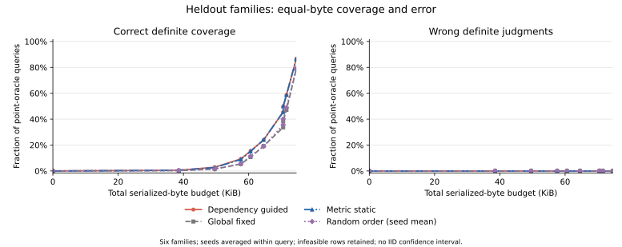

# 最终研究验收：PARTIAL，实验交付已完成

**M0–M3 已实际实施并运行；这批证据支持受控程序与特定封包协议下的验证，不足以独立构成强算法或外部 agent 泛化贡献。** 自动数值门和最终论文判断分开保留：原始 [SUMMARY.json](SUMMARY.json) / [主张表](CLAIM_EVIDENCE_MATRIX.md) 不回写；本文给出更严格的研究结论。

## 实际完成与资源

- 48 个新逻辑单元，12 个任务家族；开发/留出各 24 单元、6 族。实际沙箱执行 **48/192**，每单元一次，未重试。新增模型、Judge、付费 API 调用 **0**。
- 新增针对性测试 1,087 项通过；另有历史 HIAA 13 项测试、48 项名单核对、CI 的 8+2 条旧差异复现。依赖检查覆盖两个 fixture 各512个 mask；这些检查不是新增独立任务。
- 两划分各56个查询、67,200条重复预测，总计112查询和134,400条预测／费用配对行。预算、策略、缺证与seed是重复测量，不能增加独立样本量。
- 独立核账验证全部原始文件/输入清单/最终代码哈希、逐行费用与预算、80行聚合曲线及AUC；oracle连接晚于两份策略轨迹封存。[独立核账](../baseline-audit/DELIVERY_AUDIT.json)。

## 核心数值

本轮 UEA 与 TaskSuccess 均指 **`controlled-persistent-effect-v1` 受控变体**。留出中各24个点参照，完整观察共48/48一致；8个ALR/RIR查询缺独立原因／污染前缀参照，保持未知。所有冻结缺证回放中未观察到错误确定判断；这不等于所有查询均得到正确回答。

| 留出策略 | 族等权正确覆盖AUC | 最高冻结预算的正确覆盖 | 错误确定率 |
|---|---:|---:|---:|
| 全局固定 | 0.06928 | 78.52% | 0 |
| 随机顺序，seed均值 | 0.07131 | 79.15% | 0 |
| 指标静态 | 0.08961 | 86.56% | 0 |
| 依赖动态 | 0.09045 | 86.56% | 0 |

错误确定率分母为全部可点判参照查询；选择性错误率只在已回答查询上计算，完整分母见CSV。unknown、N/A、不可行预算与未知参照没有计为正确。Full是完整观察比较器，不是免费预算策略。

静态相对全局固定的AUC差为 **+0.02033**，六个留出家族均为正。动态相对静态仅 **+0.00084**（归一化面积约0.084个百分点），**3族正、3族负**，最高预算覆盖相同；高预算局部曲线也有不利差异。不能把这点平均增益写成稳健动态算法优势。

## 必须进入主文的限制

**1. 这不是原生产合同的完整重验证。** 新UEA只判断单个受监督动作的持久状态变化，以及精确动作/资源、session和授予/撤销时间。没有覆盖生产Manifest与Grant双重授权、全部Scope/Lifetime菱形规则、瞬时后回滚效果。完整supervisor监测可替代丢失ACK提供执行事实。TaskSuccess要求真实hash/SQL结果、task/session/resource绑定和持久变化，不覆盖只读或幂等成功。[合同边界审查](../baseline-audit/CLAIM_SCOPE_REVIEW.md)。

**2. 字节比较存在明确阈值敏感性。** 最高预算固定为76,363字节；留出完整包为76,363–76,369字节，16/24单元仅因公开头部长度多1、2或6字节便无法买齐全部通道。相邻阈值72,264和72,267仅差3字节，静态正确覆盖却由约45.59%变为50.00%。最高预算下静态与动态各有113条核心未知记录，全在这些超出预算的单元，均无足够余额获取剩余通道。原阈值与结果保留，没有为了覆盖率改预算。该发现不证明全部策略差异都由ID长度造成，但足以限制效率表述。

**3. 成本只是此协议的序列化负载代理。** 它包含初始头部、初始证据、补证原子/镜像元数据与固定padding，未测线上采集时延、网络成本或经济开销。本地分析IPC不在该代理量内。主张应限于该协议的覆盖—负载前沿。

**4. 留出是新任务操作，不是新故障机制或新harness。** 开发与留出使用不同实际文件/SQL任务，但共用合同、adapter和预设故障原型。外部ClawTrojan/OpenClaw记录存在，却缺本轮可用的独立授权或任务参照，不能写跨真实agent泛化。

**5. 真实执行不自动构成非平凡新发现。** 本轮确实观察到10次持久效果已落地但ACK丢失、8次尝试未落地、2次产物错任务绑定；另保留2次真实hash错误（D03_render_report_03、H03_manifest_package_03）。18条非零退出日志是8次预设不提交和10次ACK丢失，不能称为18次任务失败。这些是预设干预的运行核查，不是自然攻击发生率、新攻击发现或新的不可辨识定理。

## 最终主张状态

| 主张 | 最终论文判断 |
|---|---|
| 指定受控持久效果合同下的有限可靠判断 | **SUPPORTED_IN_SCOPE**；要同时给覆盖与错误率 |
| 完整生产UEA/TaskSuccess合同、外部真实agent可靠性 | **UNSUPPORTED** |
| 当前padding/整数包协议下的静态补证覆盖增益 | **SUPPORTED_IN_SCOPE**，描述性结果 |
| 可迁移的一般补证效率优势 | **PARTIAL**；头部长度和预算阈值敏感，未测线上成本 |
| 动态相对静态的小幅探索性数值改善 | **PARTIAL**；3族升3族降 |
| 强动态算法、ALR/RIR/CI新因果贡献 | **UNSUPPORTED** |

本轮应作为“框架验证与证据接口审计”的补强材料。仍缺外部合格独立来源、完整生产合同覆盖、跨故障机制验证，以及更稳健的成本合同。不能用剩余144次预算自动扩样来追求阳性。

## 复现与冻结记录

执行前登记为 [REGISTRATION.json](REGISTRATION.json)，首轮冻结为 [PLAN.json](PLAN.json)，**实际留出使用 [FINAL_PLAN.json](FINAL_PLAN.json)**。最终修订发生在任何留出执行之前：补齐全部oracle输入封存，并统一开发选择的随机seed平均。旧冻结和候选均保留。实际命令见 [COMMANDS.jsonl](COMMANDS.jsonl)，完整接口见 [实验入口](../../../experiments/evidence_contract_validation/README.md)。

复算统计时必须带上 `FINAL_PLAN.json`；不要只复制首版 `PLAN.json`。复核无需重新执行沙箱或策略。根README与阶段表保留每阶段状态，Git属性仅对本轮目录关闭换行转换，防止发布改变冻结原字节。
