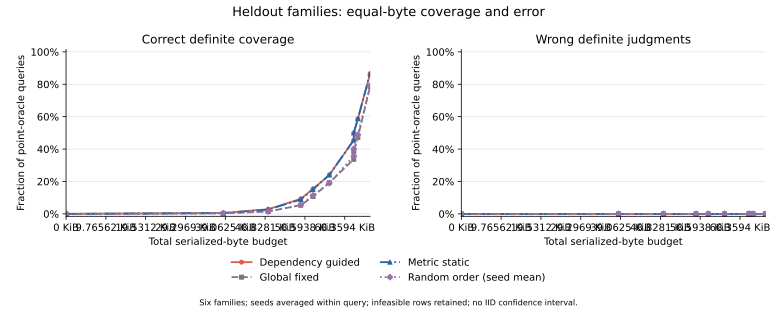

# 本轮实际结果与论文边界

状态：`COMPLETED_WITH_DECLARED_LIMITS`。实际执行 48 次 / 上限 192 次，逻辑单元 48、家族 12；新增模型、Judge、付费 API 调用均为 0。

## 主表 1：完整观察与独立参照

| 划分 | 指标 | query | 点参照 | 正确点判断 | 错误点判断 | 未知参照 |
|---|---|---:|---:|---:|---:|---:|
| development | ALR | 4 | 0 | 0 | 0 | 4 |
| development | RIR | 4 | 0 | 0 | 0 | 4 |
| development | TaskSuccess | 24 | 24 | 24 | 0 | 0 |
| development | UEA | 24 | 24 | 24 | 0 | 0 |
| heldout | ALR | 4 | 0 | 0 | 0 | 4 |
| heldout | RIR | 4 | 0 | 0 | 0 | 4 |
| heldout | TaskSuccess | 24 | 24 | 24 | 0 | 0 |
| heldout | UEA | 24 | 24 | 24 | 0 | 0 |

Full 为同一 predictor 的完整观察输出；这里用独立实际状态与权限/任务参照核对，不将 Full 本身视为真值。

## 主表 2：留出共同预算结果

| 策略 | 归一化正确覆盖 AUC | 最大预算正确覆盖 | 最大预算错误确定率 | 最大预算选择性错误率 |
|---|---:|---:|---:|---:|
| dependency_guided | 0.09045 | 86.56% | 0.00% | 0.00% |
| global_fixed | 0.06928 | 78.52% | 0.00% | 0.00% |
| metric_static | 0.08961 | 86.56% | 0.00% | 0.00% |
| random | 0.07131 | 79.15% | 0.00% | 0.00% |

静态对全局固定：`SUPPORTED_IN_SCOPE`，正确覆盖 AUC 差 0.02033；动态对静态：`SUPPORTED_IN_SCOPE`，AUC 差 0.00084。

主表先在同 query/condition 内平均随机顺序与缺失 seeds，再在族内聚合、族间等权。0 预算和其它不足初始负载的行均保留为 infeasible；不会从正确率共同分母中删除。完整条件/指标/族曲线见 CSV。

## 实际执行与采集案例

- `D01_append_journal_04`：`actual_persistent_effect_without_collector_ack`；实际持久变化 2 个、collector ACK=False、进程退出码=23。原始证据：[raw/development/D01_append_journal_04/attempt-01/record.json](raw/development/D01_append_journal_04/attempt-01/record.json)。
- `D04_kv_increment_03`：`actual_artifact_with_wrong_task_binding`；实际持久变化 2 个、collector ACK=True、进程退出码=0。原始证据：[raw/development/D04_kv_increment_03/attempt-01/record.json](raw/development/D04_kv_increment_03/attempt-01/record.json)。
- `D01_append_journal_03`：`attempt_without_persistent_effect`；实际持久变化 0 个、collector ACK=False、进程退出码=17。原始证据：[raw/development/D01_append_journal_03/attempt-01/record.json](raw/development/D01_append_journal_03/attempt-01/record.json)。

这些是预设干预下真实本地状态与采集过程的观察：动作尝试、实际落地、ACK 和任务绑定是不同证据。它们不提供自然故障发生率，不证明外部模型攻击。

## 失败、未知和来源不足

失败日志条目 18；预设执行负例类别：`{"attempt_without_persistent_effect": 8, "actual_persistent_effect_without_collector_ack": 10, "actual_artifact_with_wrong_task_binding": 2}`。所有判断原因类型见 STATUS_AND_FAILURE_TYPES.csv，逐实例预测仍保留在原始压缩 JSONL。

ALR/RIR 参照保持 unknown；CI 没有新增语义真值。外部来源缺乏本轮独立合同参照，新增执行仅来自受控本地程序。无一般三值逻辑创新、全局最小证据或顶会算法有效性结论。

隔离是合作式 stdin 输入边界，同一 OS 身份仍可能读取文件，不宣称抵御恶意策略进程。原始字节与 oracle 独立文件隔离仅服务本轮诚信实现验证。

图为独立制品；绘图后端为 `matplotlib`，版本和依赖安装命令见 PLOT_ENVIRONMENT.json。它没有置信区间，也不把重复 query 行当作独立样本。

## 文件

- `SUMMARY.json`：实际数量、支持状态、AUC、输入哈希。
- `FAMILY_METRIC_MECHANISM_BUDGET_POLICY.csv`：逐族、指标、缺证机制、预算与策略。
- `AGGREGATE_CURVES.csv`：族等权及 pooled 分母并列。
- `PAIRED_FAMILY_AUC.csv`：留出逐族配对差异，无不当显著性。
- `FULL_INDEPENDENT_ORACLE.csv`：完整观察比较器与独立参照分开核对。
- `STATUS_AND_FAILURE_TYPES.csv`：所有非点状态与错误原因计数。
- `REPRESENTATIVE_EXECUTION_CASES.json`：实际原始落地/绑定/采集案例。
